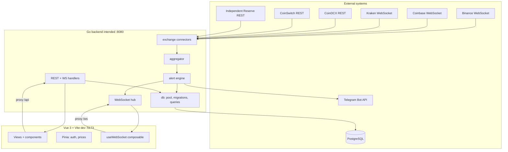
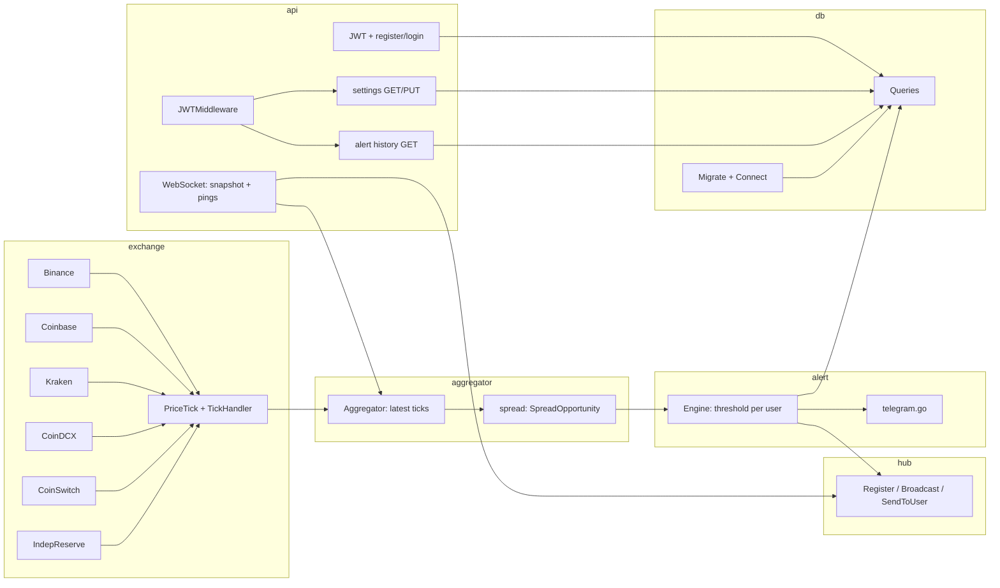
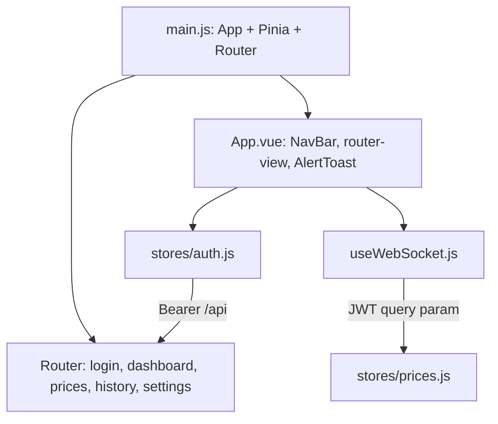
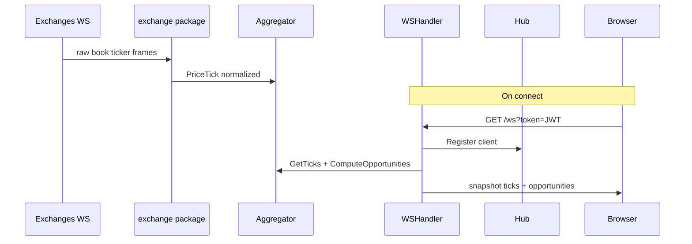
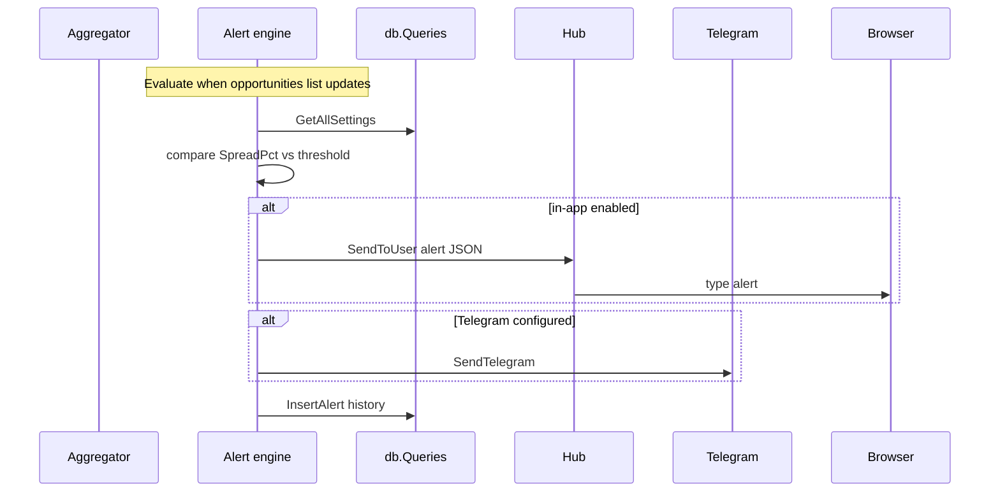

# Crypto arbitrage dashboard — architecture

This document reflects the repository layout and packages. The design spec also references `backend/cmd/server/main.go`; that entrypoint may not be present in every checkout—internal packages describe the intended runtime.

---

## High-level system

---

## Exchange transports

Binance, Coinbase, and Kraken stream live book-ticker frames over public WebSocket. CoinDCX, CoinSwitch, and Independent Reserve do not expose a usable public WebSocket for this dataset, so their connectors poll REST endpoints (CoinDCX: bulk `/exchange/ticker` every 3s; CoinSwitch: bulk `/trade/api/v2/24hr/all-pairs/ticker?exchange=coinswitchx` every 3s; Independent Reserve: per-pair `GetMarketSummary` every 5s, fan-out one goroutine per pair) and emit normalized `PriceTick`s onto the same channel. The aggregator and downstream packages are transport-agnostic.

CoinDCX contributes USDT and INR pairs; CoinSwitch contributes INR pairs; Independent Reserve contributes SGD pairs. Quote currency is encoded in the symbol (e.g. `BTC/USDT`, `BTC/INR`, `BTC/SGD`), so spread comparison naturally stays within a single quote currency.

---

## Backend packages (`backend/internal/`)

---

## Frontend (`frontend/src/`)

---

## Runtime flows

### Live prices and WebSocket snapshot

### Alerts

---

## REST and auth

- **Auth:** `POST` register/login → bcrypt + JWT (`internal/api/auth.go`).
- **Protected routes:** JWT from `Authorization: Bearer` or `?token=` (`JWTMiddleware`).
- **Settings / history:** `internal/api/settings.go`, `internal/api/history.go` → `db.Queries`.

## Local development proxy

`frontend/vite.config.js` proxies `/api` and `/ws` to `http://localhost:8080` and `ws://localhost:8080`.

## Related docs

- [Design spec](superpowers/specs/2026-05-02-crypto-arbitrage-dashboard-design.md)
